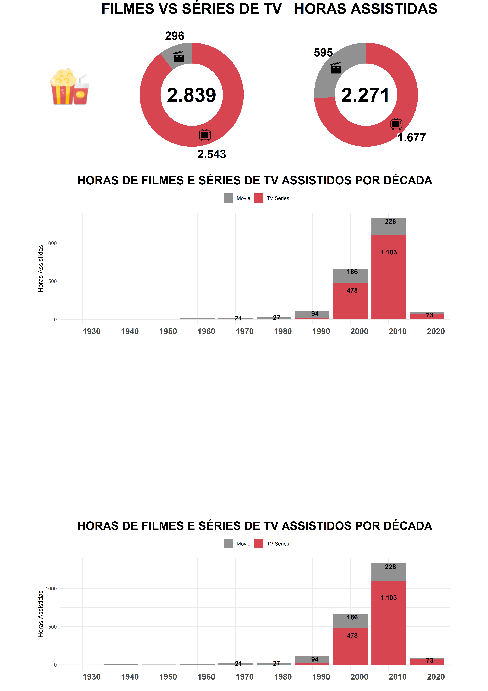

## LAYOUT EM GGPLOT 


### Carregando Bibliotecas
```{r  warning=F, message=F}
library(extrafont)
library(dplyr)
library(data.table)
library(ggplot2)
library(tidyverse)
library(scales)
require(png)
require(grid)
```

### Carregando datasets
```{r}
d_titulos <- fread("./dados/dTitleBasics.csv")
d_paises <- fread("./dados/dCountry.csv")
d_tempo <- fread("./dados/dTitleRuntime.csv")

str(d_titulos)
str(d_paises)
str(d_tempo)
```
### Tratamento e Limpeza de dados

Para otimização do trabalho será criado uma tabela principal com todas as variaveis necessarias para a criação dos gráficos.

- Pontos a serem observados:
  - Será criado uma nova coluna para a classificação em "Filme" ou "Episódio de Série de TV" a partir da coluna "titleType" da (d_titulos). Foram constatados que alguns variáveis de "titleType" podem ter sido favoritadas incorretamente quando salvas no site. Para não interfir na apuração dos dados, as mesmas serão eliminadas.
  - Vamos trabalhar com o tempo em horas, assim, é necessários transformar minutos em horas.
  
```{r warning=F, message=FALSE}
# Criar nova tabela a partir de d_titulos e realizando a classificação 
fdata <- d_titulos %>%
  select(tconst, titleType, startYear, genres) %>%
  mutate(Type = case_when(
    titleType %in% c("movie", "tvMovie") ~ "Movie",
    titleType == "tvEpisode" ~ "TV Series",
    TRUE ~ "Others"
  ))

# Filtrar os resultados para excluir aqueles que são classificados como "Others"
fdata <- filter(fdata, Type != "Others")

# Unir as tabelas d_data e d_tempo. tconst como chave primaria
fdata <- left_join(fdata, d_tempo, by = "tconst")

# Criar coluna horas e eliminar colunas desnecessarias
fdata <- fdata %>%
  mutate(Hours = runtimeMinutes / 60) %>%
  select(-titleType, -runtimeMinutes)  

fdata

```

### Criando gráficos com temas específicos
```{r warning=F, message=F}
# Temas padrão
cor_titulo <- "#000000"
fonte_titulo <- "Rockwell"
tamanho_titulo <- 30

# Cores Type
cor_series <- "#D64550"
cor_filmes <- "#919191"

dcolor <- data.frame(
  Type = c("Movie", "TV Series"),
  Color = c(cor_filmes, cor_series))


# Função para criar rótulos com imagens
imagem <- function(tipo) {
  if (tipo == "Movie") {
    return("🎬")
  } else if (tipo == "TV Series") {
    return("📺")
  } else {
    return(tipo)
  }
}

# Definindo tema
meutema <- function(){
  theme_void() +
  theme(
    # axis.title = element_text(size = 20, 
    #                           family = "Rockwell", 
    #                           colour = cor_titulos), 
    # axis.text = element_text(size = 20,
    #                          family = "Rockwell",
    #                          colour = cor_titulos),
    plot.title = element_text(size = 30,
                              family = "Rockwell",
                              colour = cor_titulo,
                              face = "bold",
                              hjust=0.5)#,
    # plot.background = element_rect(fill = NA,
    #                                colour = NA),
    # panel.background = element_rect(fill = NA,
    #                                 colour = NA),
    # axis.ticks = element_line(colour = cor_titulos,
    #                           size = 10),
    # strip.background = element_rect(fill = cor_titulos),
    # strip.text=element_text(family = "Rockwell", 
    #                         size = 15)
    )
}

#GRÁFICO 1
# tabela <- data.frame(VALORES=sort(table(x)))
# 
# g1 <- tabela %>% ggplot(aes(x=VALORES.x,y=VALORES.Freq))+
#   geom_bar(stat='identity',fill=cor_filmes)+
#   coord_flip()+
#   xlab("Categorias")+
#   ylab("Frequência")+
#   ggtitle("Gráfico 1")+
#   meutema()
# 
# #GRÁFICO 2
# g2 <- dados %>% ggplot(aes(x=y1,y=y2))+
#   geom_point(size=5,colour=cor_filmes)+
#   ggtitle("Gráfico 2")+
#   xlab("Variável 1")+
#   ylab("Variável 2")+
#   meutema()

# #GRÁFICO 3
# g3 <- dados %>% ggplot(aes(x=y3))+
#   geom_density(fill=cor_filmes)+
#   facet_grid(facets=.~grp)+
#   coord_flip()+
#   ggtitle("Gráfico 3")+
#   ylab("Densidade")+
#   xlab("Variável 3")+
#   meutema()+
#   theme(axis.text.x = element_text(size=10, family = "Rockwell",colour=cor_series))
# 
# #GRÁFICO 4
# g4 <- dados %>% ggplot(aes(x=x,y=y2))+
#   geom_boxplot(fill=cor_filmes,colour=cor_series)+
#   ggtitle("Gráfico 4")+
#   ylab("Variável 2")+
#   xlab("")+
#   meutema()

```

## Graficos

### Grafico 1

```{r warning=F, message=F}
# Calcular a contagem para cada tipo (Type) em fdata
g1_data <- table(fdata$Type)

# Total de assistidos
total_assistido <- sum(g1_data)

# Criar o dataframe e incluir as cores
g1_data <- data.frame(Type = names(g1_data), 
                      Qtde = as.numeric(g1_data))
g1_data$Freq <- (g1_data$Qtde / total_assistido)

# Mesclar com o dataframe de cores (dcolor)
g1_data <- left_join(g1_data, dcolor, by = "Type")


# Caminho para as imagens
caminho_cinema <- "./imagens/cinema.png"
caminho_tv <- "./imagens/tv.png"

# Função para criar rótulos com imagens
criar_rotulo_com_imagem <- function(tipo) {
  if (tipo == "Movie") {
    return(htmltools::img(src = caminho_cinema, width = "50px"))
  } else if (tipo == "TV Series") {
    return(htmltools::img(src = caminho_tv, width = "50px"))
  } else {
    return(tipo)
  }
}


## GRAFICO
g2 <- plot_ly(
  data = g1_data,
  labels = ~Type,
  values = ~Qtde,
  type = "pie",
  hole = 0.6, 
  marker = list(colors = ~Color),  
  textposition = "outside",
  hoverinfo = "label+text+percent",
  #text = ~paste(Type),
  textinfo = "value",
  showlegend = FALSE
) %>%
add_annotations(
  text = format(total_assistido, big.mark = "."),  # Valor total
  x = 0.5,  # Posição horizontal no centro do círculo (0 a 1)
  y = 0.5,  # Posição vertical no centro do círculo (0 a 1)
  showarrow = FALSE,  # Não mostrar seta de apontamento
  font = list(family = fonte_titulo, 
                size = 80, 
                color = cor_titulo, 
                bold = TRUE)  
)# %>%
# layout(
#   title = list(
#     text = "FILMES VS SÉRIES DE TV",
#     font = list(family = fonte_titulo, 
#                 size = tamanho_titulo, 
#                 color = cor_titulo, 
#                 bold = TRUE),
#     x = 0.5#,  # Posição horizontal do título (0 a 1)
#     #y = 0.9   # Posição vertical do título (0 a 1)
#   )
# )

g2


```


```{r, warning=FALSE, message=F}
# Calcular a contagem para cada tipo (Type) em fdata
g1_data <- table(fdata$Type)

# Total de assistidos
total_assistido <- sum(g1_data)

# Criar o dataframe e incluir as cores
g1_data <- data.frame(Type = names(g1_data), 
                      Qtde = as.numeric(g1_data))
g1_data$Freq <- (g1_data$Qtde / total_assistido)

# Mesclar com o dataframe de cores (dcolor)
g1_data <- left_join(g1_data, dcolor, by = "Type")

g1_data <- g1_data %>% 
  arrange(desc(Type))

# Criar o gráfico
g1 <- ggplot(
  g1_data, 
  aes(x = 1,
      y = Freq,
      fill = Color)) +
  geom_bar(width = 1,
           stat = "identity") +
  coord_polar("y",
              start = 0) +
  xlim(c(-1, 2)) +
  theme_void() +
  theme(plot.title = element_text(hjust = 0.5,
                                  size = 20,
                                  face = "bold")) +
  geom_text(aes(label = paste(sapply(Type,
                                     imagem))), 
            position = position_stack(vjust = 0.5), 
            size = 9) +
  geom_label(aes(x = 2.0, 
                 label = format(Qtde, 
                                big.mark = ".")), 
             position = position_stack(vjust = 0.5),
             size = 7,
             fill = "white",
             label.padding = unit(0.0, "lines"),
             label.size = 0.0,
             na.rm = FALSE,
             fontface = "bold") +
  ggtitle("FILMES VS SÉRIES DE TV") +
  scale_fill_identity() +
  theme(plot.title = element_text(size = 25,
                                  face = "bold")) +
  annotate("text",
           label = format(total_assistido, 
                          big.mark = "."),
           family = fonte_titulo,
           fontface = "bold",
           color = cor_titulo,
           size = 12,
           x = -1,
           y = 0) 

# Exibir o gráfico
print(g1)

```

## GRAFICO 2
```{r, warning=FALSE, message=F}
# Criando dataset
g2_data <- fdata %>%
  filter(!is.na(Hours)) %>%  # Remover entradas com NA em Hours
  group_by(Type) %>%
  summarise(Hours = sum(Hours))

# Total de horas assistidas
horas_assistidas <- round(sum(g2_data$Hours, na.rm = TRUE))
horas_assistidas

# Criar o dataframe e incluir as cores
g2_data$Freq <- (g2_data$Hours / horas_assistidas)

# Mesclar com o dataframe de cores (dcolor)
g2_data <- left_join(g2_data, dcolor, by = "Type")

g2_data <- g2_data %>% 
  arrange(desc(Type))

# Criar o gráfico
g2 <- ggplot(
  g2_data, 
  aes(x = 1,
      y = Freq,
      fill = Color)) +
  geom_bar(width = 1,
           stat = "identity") +
  coord_polar("y",
              start = 0) +
  xlim(c(-1, 2)) +
  theme_void() +
  theme(plot.title = element_text(hjust = 0.5,
                                  size = 20,
                                  face = "bold")) +
  geom_text(aes(label = paste(sapply(Type,
                                     imagem))), 
            position = position_stack(vjust = 0.5), 
            size = 9) +
  geom_label(aes(x = 2.0, 
                 label = format(round(Hours), 
                                big.mark = ".")), 
             position = position_stack(vjust = 0.5),
             size = 7,
             fill = "white",
             label.padding = unit(0.0, "lines"),
             label.size = 0.0,
             na.rm = FALSE,
             fontface = "bold") +
  ggtitle("HORAS ASSISTIDAS") +
  scale_fill_identity() +
  theme(plot.title = element_text(size = 25,
                                  face = "bold")) +
  annotate("text",
           label = format(horas_assistidas, 
                          big.mark = "."),
           family = fonte_titulo,
           fontface = "bold",
           color = cor_titulo,
           size = 12,
           x = -1,
           y = 0) 

# Exibir o gráfico
print(g2)

```

## GRAFICO 2
```{r, warning=FALSE, message=F}
# Criando dataset
g3_data <- select(fdata, startYear, Type, Hours) %>%
  filter(!is.na(Hours))
g3_data$Year <- as.character(floor(g3_data$startYear / 10) * 10)

g3_data <- g3_data %>%
  filter(!is.na(Year)) %>%  # Remover entradas com NA em Hours
  group_by(Year, Type) %>%
  summarise(Hours = sum(Hours))

# Criar o dataframe e incluir as cores
#g3_data$Freq <- (g3_data$Hours / horas_assistidas)

# Mesclar com o dataframe de cores (dcolor)
g3_data <- left_join(g3_data, dcolor, by = "Type")

# g3_data <- g3_data %>% 
#   arrange(desc(Type))


# Criar o gráfico
g3 <- ggplot(
  g3_data,
  aes(fill = Type,
      y = Hours,
      x = Year,
      label = format(round(Hours), big.mark = "."))) + 
  geom_bar(position = "stack",
           stat = "identity") +
  geom_text(data = subset(g3_data, Hours > 20),  
            position = position_stack(vjust = 0.8, reverse = FALSE),
            size = 4,  
            color = "black",  
            fontface = "bold",  
            show.legend = FALSE) +  
  ggtitle("HORAS DE FILMES E SÉRIES DE TV ASSISTIDOS POR DÉCADA") +
  xlab("") +
  ylab("Horas Assistidas") +
  scale_fill_manual(values = c(cor_filmes, cor_series)) +  
  theme_minimal() +
  theme(plot.title = element_text(hjust = 0.5,
                                  size = 20,
                                  face = "bold"),
        axis.text.x = element_text(size = 14,  
                                   face = "bold",  
                                   vjust = 0.5,  
                                   hjust = 0),   
        axis.text.y = element_text(),
        legend.position = "top",  
        legend.justification = "center",  
        legend.title = element_blank(),
        legend.box = "horizontal") 

# Exibir o gráfico
print(g3)

```


```{r}


ggplot(g3_data,
       aes(fill = Type,
          y = Hours,
          x = Year)) + 
    geom_bar(position="stack", stat="identity") +
    #scale_fill_viridis(discrete = T) +
    ggtitle("Studying 4 species..") +
    #theme_ipsum() +
    xlab("")

```


### Criando layout de painel final
```{r warning=F, message=F}

#IMPORTANDO IMAGENS
imag1 <- readPNG("./imagens/PaginaA4.png")
im1<- rasterGrob(imag1,width = unit(29.7,"cm"), height = unit(42.0,"cm"))

imag2 <- readPNG("./imagens/Pipoca.png")
im2 <- rasterGrob(imag2,width = unit(2.40,"cm"), height = unit(2.40,"cm"))

#CRIANDO IMAGEM
png("painel.png", width = 29.7 , height = 42.0, units = "cm", res = 500)

#CONSTRUIR UM NOVO GRID
grid.newpage() 

#CABEÇALHO E TEXTOS
pushViewport(viewport(layout = grid.layout(1, 1)))
print(grid.draw(im1))

grid.text("POPCORN 
          TIME", 
          x = unit(.4, "cm"), 
          y = unit(.4, "cm"),
          hjust = 1, 
          gp = gpar(fontfamily = "Rockwell", 
                    col = cor_titulo, 
                    cex = 4))


#INCLUINDO GRÁFICOS
pushViewport(viewport(layout = grid.layout(4, 14)))
print(g1, vp = viewport(layout.pos.row=1, layout.pos.col = 4:8))
print(g2, vp = viewport(layout.pos.row=1, layout.pos.col = 9:13))
print(g3, vp = viewport(layout.pos.row=2, layout.pos.col = 2:13))
print(g3, vp = viewport(layout.pos.row=4, layout.pos.col = 2:13))


#INCLUINDO RLOGO
pushViewport(viewport(layout.pos.row=1, layout.pos.col = 2:3))
print(grid.draw(im2))

dev.off()
```

### Resultado Final

```{r echo=FALSE, out.width="70%", fig.align='center'}

```


